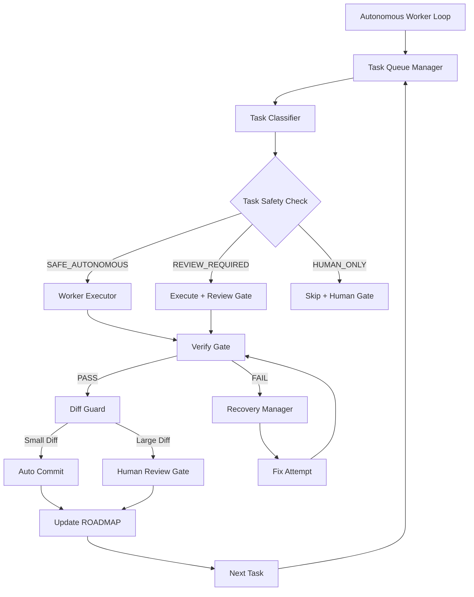
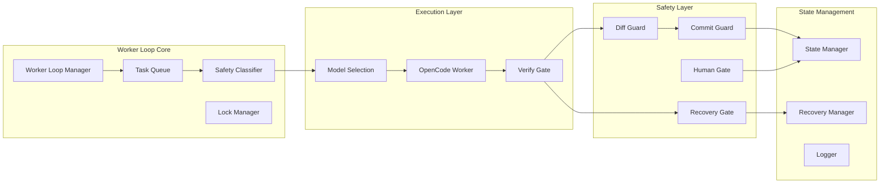
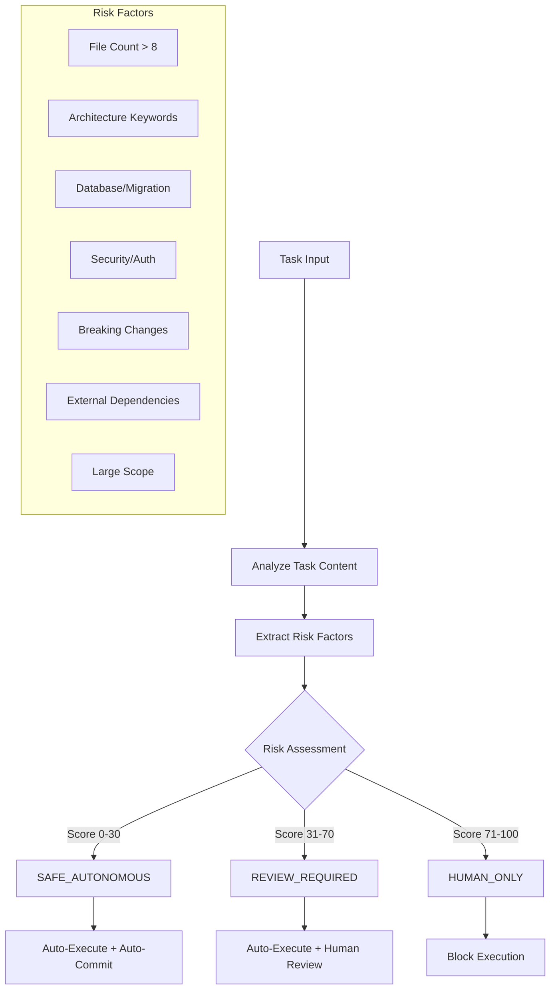
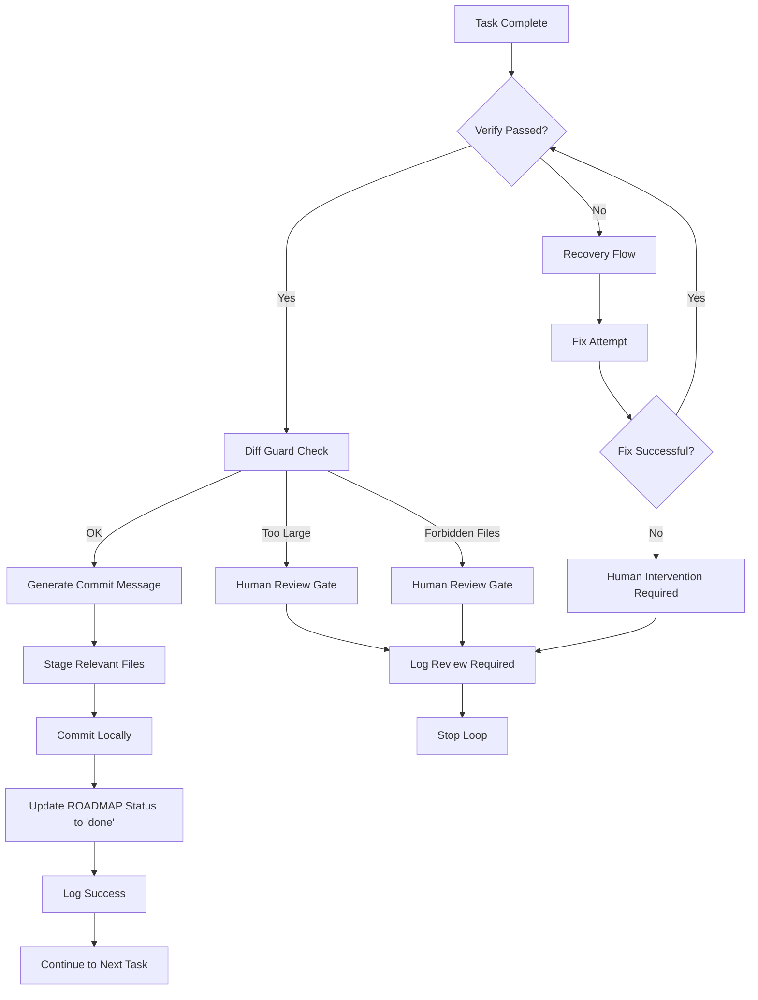
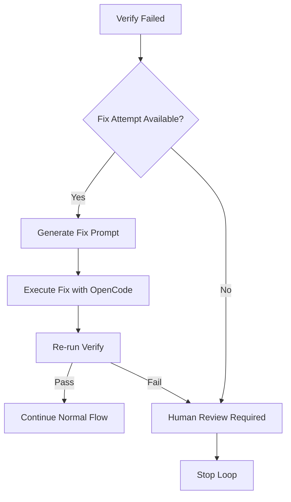
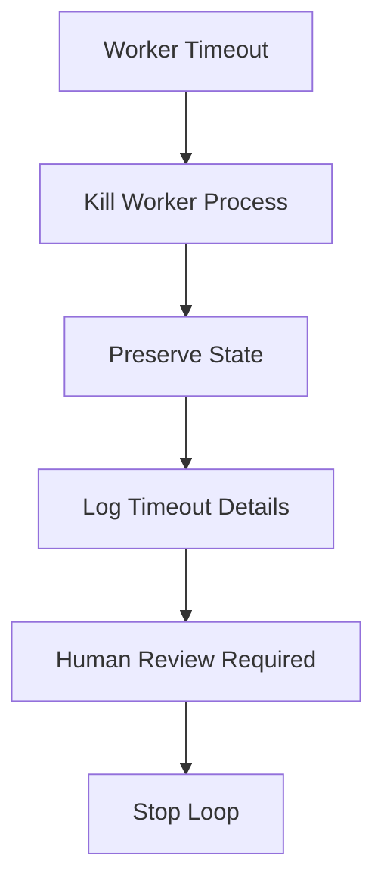
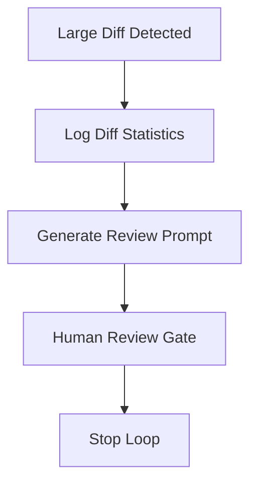
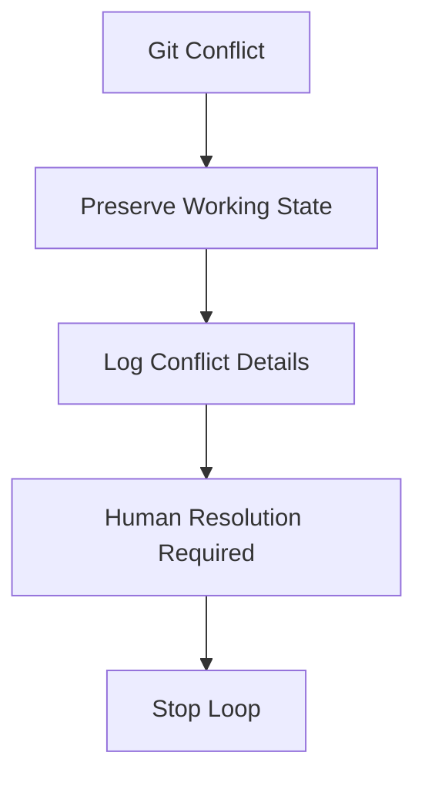

# Autonomous Worker Loop - Technischer Implementierungsplan

**Erstellt:** 2026-05-16T20:09:00.000Z  
**Autor:** Roo Architect  
**Status:** Ready for Implementation  
**Priorität:** P1 - Core Infrastructure

---

## Executive Summary

Dieser Plan definiert die Implementierung eines sicheren autonomen Worker-Loops für das HealthApp-Repository. Der Worker soll mehrere ROADMAP-Tasks sequenziell ohne permanente Benutzerinteraktion abarbeiten können, dabei aber strenge Sicherheitsgrenzen einhalten und niemals automatisch pushen.

**Kernziel:** Erweitere die bestehende Agent-Infrastruktur (Phasen A-E) um einen echten Multi-Task-Loop mit intelligenter Task-Klassifikation und automatisierten Sicherheits-Gates.

---

## 1. Analyse der bestehenden Infrastruktur

### 1.1 Vorhandene Komponenten (Bereits implementiert)

#### **Governance-Layer**

- ✅ **SSOK.md** - Übergeordnete Governance-Struktur
- ✅ **ROADMAP.md** - Single Source of Knowledge für Tasks
- ✅ **VERIFY.md** - Definition of Done und Verify-Pipeline
- ✅ **AGENTS.md** - Agent-Governance und Arbeitsregeln

#### **Agent-Script-System (Phasen A-E)**

- ✅ **Phase A:** [`select-next-task.mjs`](scripts/agent/select-next-task.mjs) - Task-Auswahl mit robustem Parser
- ✅ **Phase B:** [`run-agent-loop.mjs`](scripts/agent/run-agent-loop.mjs) - State-Management und Gates
- ✅ **Phase C:** [`run-opencode-worker.mjs`](scripts/agent/run-opencode-worker.mjs) - OpenCode-Integration mit Timeout/Observability
- ✅ **Phase D:** [`run-auto-task.mjs`](scripts/agent/run-auto-task.mjs) - Single-Task-Automation mit Fix-Attempts
- ✅ **Phase E:** [`run-milestone.mjs`](scripts/agent/run-milestone.mjs) - Multi-Task-Runner mit Gates

#### **Unterstützende Systeme**

- ✅ **ROADMAP-Parser:** [`roadmap-parser.mjs`](scripts/agent/roadmap-parser.mjs) - Multi-Format Task-Parsing
- ✅ **Verify-Pipeline:** [`run-verify.mjs`](scripts/agent/run-verify.mjs) - Strukturierte Verification
- ✅ **Model-Selection:** [`select-model.mjs`](scripts/agent/select-model.mjs) - LLM-Router mit Registry
- ✅ **State-Management:** `.agent/state.json` - Persistente Zustandsverwaltung
- ✅ **Monitoring:** [`watch-agent.mjs`](scripts/agent/watch-agent.mjs) - Live-Dashboard

#### **Sicherheitsgrenzen (Bereits implementiert)**

- ✅ Keine .env-Manipulation
- ✅ Keine automatischen Commits/Pushes
- ✅ Keine Dependency-Installation
- ✅ Strukturierte Gates für Human Review
- ✅ Timeout-Systeme und Heartbeat-Monitoring
- ✅ Diff-Guards (basic) in run-milestone.mjs

### 1.2 Identifizierte Lücken

#### **Fehlende Komponenten für echten Autonomous Loop**

- ❌ **Task-Klassifikation** - Intelligente Sicherheitsbewertung
- ❌ **Automatisierte Commits** - Sichere Commit-Automation
- ❌ **Enhanced Recovery** - Robuste Failure-Handling
- ❌ **Lock-Management** - Concurrency-Schutz
- ❌ **Echte Multi-Task-Schleife** - Kontinuierliche Ausführung

---

## 2. Zielarchitektur

### 2.1 Autonomous Worker Loop - Kernarchitektur



### 2.2 Erweiterte Komponenten-Architektur



### 2.3 Task-Klassifikations-System



---

## 3. Sicherheitsmodell

### 3.1 Task-Klassifikation Heuristiken

#### **SAFE_AUTONOMOUS (Score: 0-30)**

**Kriterien:**

- Einzelne Datei-Änderungen (< 5 Dateien)
- Reine Code-Fixes ohne Architektur-Änderungen
- Test-Ergänzungen
- Dokumentations-Updates
- Lint/Format-Fixes
- Kleine Bug-Fixes mit klarem Scope

**Keywords (niedrige Risiko-Scores):**

- "fix", "test", "docs", "lint", "format", "typo", "comment"

**Automatisierung:**

- ✅ Auto-Execute
- ✅ Auto-Commit (bei Verify PASS + Small Diff)
- ✅ Auto-ROADMAP-Update

#### **REVIEW_REQUIRED (Score: 31-70)**

**Kriterien:**

- Mehrere Datei-Änderungen (5-15 Dateien)
- Neue Features mit begrenztem Scope
- Refactoring innerhalb eines Moduls
- API-Änderungen ohne Breaking Changes
- Performance-Optimierungen

**Keywords (mittlere Risiko-Scores):**

- "feature", "refactor", "optimize", "improve", "enhance"

**Automatisierung:**

- ✅ Auto-Execute
- ❌ Auto-Commit (Human Review Gate)
- ❌ Auto-ROADMAP-Update

#### **HUMAN_ONLY (Score: 71-100)**

**Kriterien:**

- Architektur-Änderungen
- Database-Schema-Änderungen
- Security-relevante Änderungen
- Breaking API Changes
- Dependency-Updates
- Große Refactorings (> 15 Dateien)

**Keywords (hohe Risiko-Scores):**

- "migration", "security", "auth", "breaking", "architecture", "schema"

**Automatisierung:**

- ❌ Auto-Execute (Block)
- ❌ Auto-Commit
- ❌ Auto-ROADMAP-Update

### 3.2 Sicherheits-Gates

#### **Pre-Execution Gates**

1. **Git Working Tree Clean Check**
2. **Task Safety Classification**
3. **ROADMAP Task Status Validation**
4. **Resource Lock Acquisition**
5. **Model Risk Assessment**

#### **Execution Gates**

1. **Worker Timeout Monitoring** (15 min default)
2. **Live Diff Size Monitoring**
3. **Heartbeat Monitoring** (30s intervals)
4. **Inactivity Timeout** (90s no output)

#### **Post-Execution Gates**

1. **Verify Success Requirement** (npm run verify)
2. **Diff Size Guard** (max. 500 Zeilen, 8 Dateien)
3. **File Type Validation** (keine .env, secrets)
4. **Commit Message Validation**
5. **Human Review Gate** (für REVIEW_REQUIRED)

### 3.3 Diff-Guard Spezifikation

```javascript
const DIFF_LIMITS = {
  SAFE_AUTONOMOUS: {
    maxFiles: 5,
    maxLines: 200,
    allowedFileTypes: ['.ts', '.tsx', '.js', '.jsx', '.md', '.json'],
    forbiddenFiles: ['.env', 'package.json', 'package-lock.json'],
  },
  REVIEW_REQUIRED: {
    maxFiles: 15,
    maxLines: 500,
    allowedFileTypes: ['.ts', '.tsx', '.js', '.jsx', '.md', '.json'],
    forbiddenFiles: ['.env', 'package.json', 'package-lock.json'],
  },
};
```

---

## 4. Commit-Strategie

### 4.1 Automatisierte Commit-Logik



### 4.2 Commit-Message-Format

```
<type>(<scope>): <description>

<body>

Automated-By: Autonomous Worker Loop
Task-ID: <ROADMAP-Task-ID>
Verify-Status: PASSED
Files-Changed: <count>
Lines-Changed: <count>
```

**Beispiel:**

```
fix(nutrition): resolve zero-macro blocker in resolver

- Add validation for kcal > 0 in food entries
- Update error handling in nutrition input flow
- Add unit tests for zero-macro validation

Automated-By: Autonomous Worker Loop
Task-ID: P1-003
Verify-Status: PASSED
Files-Changed: 3
Lines-Changed: 45
```

### 4.3 Commit-Sicherheitsregeln

#### **Auto-Commit erlaubt wenn:**

- ✅ Task-Klassifikation: SAFE_AUTONOMOUS
- ✅ Verify Status: PASSED
- ✅ Diff Size: Innerhalb Limits
- ✅ File Types: Nur erlaubte Dateien
- ✅ No Forbidden Files: Keine .env, package.json, etc.

#### **Human Review erforderlich wenn:**

- ❌ Task-Klassifikation: REVIEW_REQUIRED oder HUMAN_ONLY
- ❌ Verify Status: FAILED
- ❌ Diff Size: Über Limits
- ❌ Forbidden Files: .env, package.json, etc. geändert
- ❌ Git Conflicts: Merge-Konflikte erkannt

---

## 5. Recovery-Mechanismus

### 5.1 Failure Types & Recovery Strategies

#### **Verify Failure**



**Recovery Actions:**

1. Generiere Fix-Prompt basierend auf Verify-Errors
2. Ein Fix-Versuch mit OpenCode Worker
3. Re-run Verify Pipeline
4. Bei erneutem Fehler: Human Review Gate

#### **Worker Timeout**



**Recovery Actions:**

1. Graceful Worker Termination (SIGTERM → SIGKILL)
2. State Preservation in `.agent/recovery/`
3. Detailed Logging für Human Analysis
4. Stop Loop → Human Intervention

#### **Large Diff**



**Recovery Actions:**

1. Diff-Statistiken loggen
2. Review-Prompt für Human generieren
3. Stop Loop → Human Review

#### **Git Conflicts**



**Recovery Actions:**

1. Working Tree State preservieren
2. Conflict Details loggen
3. Stop Loop → Human Resolution

### 5.2 Recovery State Management

#### **Recovery State Schema**

```json
{
  "recoveryState": {
    "failureType": "verify_failed|worker_timeout|large_diff|git_conflict",
    "taskId": "P1-003",
    "taskTitle": "Fix zero-macro blocker",
    "attemptCount": 1,
    "maxAttempts": 1,
    "lastError": "TypeScript compilation failed",
    "recoveryActions": ["fix_attempt", "human_review"],
    "preservedFiles": [
      ".agent/out/fix-prompt.md",
      ".agent/out/verify-report.md",
      ".agent/out/opencode-report.md"
    ],
    "diffStats": {
      "filesChanged": 8,
      "linesAdded": 150,
      "linesDeleted": 45
    },
    "timestamp": "2026-05-16T20:09:00.000Z",
    "humanActionRequired": true
  }
}
```

#### **Recovery Persistence**

- **Location:** `.agent/recovery/recovery-state.json`
- **Backup:** `.agent/recovery/recovery-<timestamp>.json`
- **Cleanup:** Automatische Bereinigung nach 7 Tagen

---

## 6. Implementierungsplan

### 6.1 Sprint 1: Foundation (Woche 1-2)

#### **Ziel:** Erweitere bestehende Infrastruktur um echten Multi-Task-Loop

#### **Tasks:**

##### **1.1 Erweitere run-milestone.mjs um echten Loop**

- **File:** [`scripts/agent/run-milestone.mjs`](scripts/agent/run-milestone.mjs)
- **Changes:**
  - Entferne `maxTasks` Limitation
  - Implementiere kontinuierliche Task-Queue
  - Erweitere um Task-Klassifikation-Integration
  - Verbessere Error-Handling

##### **1.2 Implementiere Task-Classifier**

- **New File:** `scripts/agent/task-classifier.mjs`
- **Functionality:**
  - Heuristische Task-Analyse
  - Risk-Score-Berechnung
  - Keyword-basierte Klassifikation
  - Integration mit ROADMAP-Parser

##### **1.3 Erweitere Diff-Guard**

- **New File:** `scripts/agent/diff-guard.mjs`
- **Functionality:**
  - Git diff Analyse
  - File-Count und Line-Count Limits
  - File-Type Validation
  - Forbidden-File Detection

##### **1.4 Implementiere Lock-Manager**

- **New File:** `scripts/agent/lock-manager.mjs`
- **Functionality:**
  - Process-Lock für Worker-Loop
  - PID-basierte Lock-Files
  - Graceful Lock-Release
  - Stale-Lock Detection

#### **Deliverables:**

- ✅ Funktionierender Multi-Task-Loop
- ✅ Task-Klassifikation mit SAFE_AUTONOMOUS
- ✅ Enhanced Diff-Guards
- ✅ Concurrency-Schutz

#### **Testing:**

- Unit Tests für Task-Classifier
- Integration Tests mit SAFE_AUTONOMOUS Tasks
- Lock-Manager Concurrency Tests

### 6.2 Sprint 2: Safety & Automation (Woche 3-4)

#### **Ziel:** Implementiere sichere Commit-Automation und Recovery

#### **Tasks:**

##### **2.1 Implementiere Commit-Manager**

- **New File:** `scripts/agent/commit-manager.mjs`
- **Functionality:**
  - Automatisierte Commit-Message-Generierung
  - Selective File Staging
  - ROADMAP Status Updates
  - Commit-Validation

##### **2.2 Erweitere Recovery-Manager**

- **New File:** `scripts/agent/recovery-manager.mjs`
- **Functionality:**
  - Failure-Type Detection
  - Recovery-State Persistence
  - Automated Fix-Attempts
  - Human-Handoff Preparation

##### **2.3 Implementiere Safety-Gates**

- **New File:** `scripts/agent/safety-gates.mjs`
- **Functionality:**
  - Zentrale Gate-Logik
  - Pre/Post-Execution Checks
  - Risk-Assessment Integration
  - Gate-Bypass Prevention

##### **2.4 Enhanced State-Management**

- **Extend:** `.agent/state.json` Schema
- **New:** `.agent/config/autonomous.json`
- **Functionality:**
  - Erweiterte State-Properties
  - Configuration Management
  - State-Validation

#### **Deliverables:**

- ✅ Automatisierte Commits für SAFE_AUTONOMOUS
- ✅ Robuste Recovery-Mechanismen
- ✅ Comprehensive Safety-Gates
- ✅ Enhanced Configuration

#### **Testing:**

- Commit-Manager Integration Tests
- Recovery-Scenario Tests
- Safety-Gate Bypass Tests
- End-to-End Automation Tests

### 6.3 Sprint 3: Production-Ready (Woche 5-6)

#### **Ziel:** Production-Ready System mit Monitoring und Documentation

#### **Tasks:**

##### **3.1 Enhanced Monitoring**

- **Extend:** [`scripts/agent/watch-agent.mjs`](scripts/agent/watch-agent.mjs)
- **New:** `scripts/agent/worker-monitor.mjs`
- **Functionality:**
  - Real-time Loop Monitoring
  - Performance Metrics
  - Alert System
  - Dashboard Enhancements

##### **3.2 Structured Logging**

- **New:** `.agent/logs/` Directory Structure
- **New:** `scripts/agent/logger.mjs`
- **Functionality:**
  - Structured JSON Logs
  - Log Rotation
  - Performance Logging
  - Error Aggregation

##### **3.3 Human-Review Interface**

- **New:** `scripts/agent/review-interface.mjs`
- **Functionality:**
  - CLI-based Review Interface
  - Diff Presentation
  - Approval/Rejection Workflow
  - Review History

##### **3.4 Configuration Management**

- **New:** `.agent/config/task-classification.json`
- **New:** `.agent/config/safety-limits.json`
- **Functionality:**
  - Configurable Classification Rules
  - Adjustable Safety Limits
  - Environment-specific Configs
  - Schema Validation

#### **Deliverables:**

- ✅ Production-Ready Monitoring
- ✅ Comprehensive Logging
- ✅ Human-Review Interface
- ✅ Flexible Configuration

#### **Testing:**

- Load Testing (100+ Tasks)
- Stress Testing (Failure Scenarios)
- User Acceptance Testing
- Performance Benchmarking

### 6.4 Sprint 4: Intelligence & Optimization (Woche 7-8)

#### **Ziel:** Intelligente Features und Performance-Optimierung

#### **Tasks:**

##### **4.1 ML-basierte Task-Klassifikation (Optional)**

- **New:** `scripts/agent/ml-classifier.mjs`
- **Functionality:**
  - Machine Learning Model
  - Training Data Collection
  - Adaptive Classification
  - Human-Feedback Integration

##### **4.2 Adaptive Thresholds**

- **Extend:** Task-Classifier
- **Functionality:**
  - Learning from Human-Feedback
  - Dynamic Threshold Adjustment
  - Success-Rate Optimization
  - Risk-Calibration

##### **4.3 Cross-Task Dependencies**

- **New:** `scripts/agent/dependency-analyzer.mjs`
- **Functionality:**
  - Task-Dependency Detection
  - Optimal Task-Ordering
  - Parallel-Execution Planning
  - Dependency-Graph Visualization

##### **4.4 Performance Optimization**

- **Optimize:** All Core Components
- **Functionality:**
  - Caching Strategies
  - Parallel Processing
  - Memory Optimization
  - Startup Time Reduction

#### **Deliverables:**

- ✅ Intelligent Task-Classification
- ✅ Adaptive System Behavior
- ✅ Optimized Performance
- ✅ Advanced Features

---

## 7. Neue Dateien und Verzeichnisstruktur

### 7.1 Core Worker Loop Files

```
scripts/agent/
├── run-autonomous-loop.mjs          # Hauptschleife (erweitert run-milestone.mjs)
├── task-classifier.mjs              # Task-Sicherheits-Klassifikation
├── diff-guard.mjs                   # Diff-Größe und Sicherheitsprüfung
├── commit-manager.mjs               # Automatisierte Commit-Logik
├── lock-manager.mjs                 # Concurrency-Schutz
├── recovery-manager.mjs             # Failure-Handling
├── safety-gates.mjs                 # Zentrale Sicherheitsprüfungen
├── worker-monitor.mjs               # Enhanced Monitoring
├── review-interface.mjs             # Human-Review Interface
├── logger.mjs                       # Structured Logging
└── dependency-analyzer.mjs          # Task-Dependencies (Optional)
```

### 7.2 Configuration Files

```
.agent/config/
├── autonomous.json                  # Worker-Loop-Konfiguration
├── task-classification.json         # Klassifikations-Regeln
├── safety-limits.json              # Sicherheits-Limits
└── models.json                      # Model-Registry (bereits vorhanden)
```

### 7.3 State and Recovery

```
.agent/
├── state.json                       # Erweiterte State-Properties
├── recovery/
│   ├── recovery-state.json         # Aktueller Recovery-State
│   └── recovery-<timestamp>.json   # Recovery-Backups
└── logs/
    ├── worker-loop.log             # Hauptschleife Logs
    ├── task-execution.log          # Task-Ausführung Logs
    ├── safety-gates.log            # Sicherheits-Events
    └── performance.log             # Performance-Metriken
```

### 7.4 Package.json Scripts

```json
{
  "scripts": {
    "agent:autonomous": "node scripts/agent/run-autonomous-loop.mjs",
    "agent:autonomous:start": "node scripts/agent/run-autonomous-loop.mjs --start",
    "agent:autonomous:stop": "node scripts/agent/run-autonomous-loop.mjs --stop",
    "agent:autonomous:status": "node scripts/agent/run-autonomous-loop.mjs --status",
    "agent:review": "node scripts/agent/review-interface.mjs",
    "agent:monitor": "node scripts/agent/worker-monitor.mjs",
    "agent:classify": "node scripts/agent/task-classifier.mjs",
    "agent:recovery": "node scripts/agent/recovery-manager.mjs"
  }
}
```

---

## 8. Risikoanalyse und Mitigation

### 8.1 Hohe Risiken

#### **8.1.1 Ungewollte Commits**

**Risiko:** Automatische Commits von fehlerhaftem oder unsicherem Code

**Mitigation:**

- ✅ Strenge Task-Klassifikation (nur SAFE_AUTONOMOUS)
- ✅ Mandatory Verify-Pipeline (npm run verify)
- ✅ Diff-Guards (Größe, File-Types)
- ✅ Forbidden-File Detection
- ✅ Human Review Gates für REVIEW_REQUIRED

#### **8.1.2 Endlosschleifen**

**Risiko:** Worker-Loop läuft endlos ohne Fortschritt

**Mitigation:**

- ✅ Max-Iterations Limit (default: 10 Tasks)
- ✅ Timeout-Systeme (15 min per Task)
- ✅ Heartbeat-Monitoring (30s intervals)
- ✅ Inactivity-Detection (90s no output)
- ✅ Lock-Manager (verhindert parallele Loops)

#### **8.1.3 Falsche Task-Klassifikation**

**Risiko:** Gefährliche Tasks als SAFE_AUTONOMOUS klassifiziert

**Mitigation:**

- ✅ Conservative Defaults (bei Unsicherheit → HUMAN_ONLY)
- ✅ Keyword-basierte Blacklists
- ✅ Human-Feedback Learning (Sprint 4)
- ✅ Manual Override Möglichkeiten
- ✅ Audit-Logs für alle Klassifikationen

#### **8.1.4 State-Corruption**

**Risiko:** Korrupte State-Dateien führen zu unvorhersagbarem Verhalten

**Mitigation:**

- ✅ Atomic State Updates (write-temp-rename)
- ✅ State-Schema Validation
- ✅ State-Backups vor kritischen Operationen
- ✅ Recovery-Mechanismen für korrupte States
- ✅ State-Integrity Checks

#### **8.1.5 Resource-Konflikte**

**Risiko:** Parallele Worker-Instanzen interferieren miteinander

**Mitigation:**

- ✅ Lock-Manager mit PID-basiertem Locking
- ✅ Stale-Lock Detection und Cleanup
- ✅ Graceful Shutdown Handling
- ✅ Resource-Cleanup bei Termination

### 8.2 Mittlere Risiken

#### **8.2.1 Worker-Hänger**

**Risiko:** OpenCode Worker hängt ohne Fortschritt

**Mitigation:**

- ✅ Worker-Timeout (15 min)
- ✅ Inactivity-Timeout (90s)
- ✅ Heartbeat-System
- ✅ Forced Termination (SIGTERM → SIGKILL)

#### **8.2.2 Verify-False-Positives**

**Risiko:** Verify-Pipeline meldet fälschlicherweise Erfolg

**Mitigation:**

- ✅ Multiple Verify-Checks (typecheck, lint, test)
- ✅ Exit-Code Validation
- ✅ Output-Pattern Detection
- ✅ Human Review Gates als Fallback

#### **8.2.3 Git-Konflikte**

**Risiko:** Git-Merge-Konflikte blockieren Automation

**Mitigation:**

- ✅ Clean Working Tree Requirement
- ✅ Git-Status Checks vor Task-Start
- ✅ Conflict Detection und Stop
- ✅ Human Resolution Workflow

### 8.3 Niedrige Risiken

#### **8.3.1 Log-Overflow**

**Risiko:** Log-Dateien werden zu groß

**Mitigation:**

- ✅ Log-Rotation (daily, max 10 files)
- ✅ Log-Level Configuration
- ✅ Structured JSON Logging
- ✅ Automatic Cleanup (7 days)

#### **8.3.2 Config-Drift**

**Risiko:** Konfigurationsdateien werden inkonsistent

**Mitigation:**

- ✅ Schema-Validation für alle Configs
- ✅ Default-Value Fallbacks
- ✅ Config-Integrity Checks
- ✅ Version-Controlled Config Templates

---

## 9. Testing-Strategie

### 9.1 Unit Tests

#### **Task-Classifier Tests**

```javascript
describe('TaskClassifier', () => {
  test('classifies simple fix as SAFE_AUTONOMOUS', () => {
    const task = { title: 'Fix typo in documentation', description: 'Simple typo fix' };
    expect(classifier.classify(task)).toBe('SAFE_AUTONOMOUS');
  });

  test('classifies migration as HUMAN_ONLY', () => {
    const task = { title: 'Database migration for user schema' };
    expect(classifier.classify(task)).toBe('HUMAN_ONLY');
  });
});
```

#### **Diff-Guard Tests**

```javascript
describe('DiffGuard', () => {
  test('allows small diff within limits', () => {
    const diff = { filesChanged: 3, linesChanged: 50 };
    expect(diffGuard.isAllowed(diff, 'SAFE_AUTONOMOUS')).toBe(true);
  });

  test('blocks large diff over limits', () => {
    const diff = { filesChanged: 10, linesChanged: 600 };
    expect(diffGuard.isAllowed(diff, 'SAFE_AUTONOMOUS')).toBe(false);
  });

  test('blocks forbidden files', () => {
    const diff = { filesChanged: 1, linesChanged: 5, files: ['.env'] };
    expect(diffGuard.isAllowed(diff, 'SAFE_AUTONOMOUS')).toBe(false);
  });
});
```

#### **Commit-Manager Tests**

```javascript
describe('CommitManager', () => {
  test('generates proper commit message', () => {
    const task = { id: 'P1-003', title: 'Fix zero-macro blocker' };
    const diff = { filesChanged: 3, linesChanged: 45 };
    const message = commitManager.generateMessage(task, diff);

    expect(message).toContain('fix(nutrition): resolve zero-macro blocker');
    expect(message).toContain('Task-ID: P1-003');
    expect(message).toContain('Files-Changed: 3');
  });
});
```

### 9.2 Integration Tests

#### **End-to-End Autonomous Loop Tests**

```javascript
describe('AutonomousLoop Integration', () => {
  test('processes SAFE_AUTONOMOUS task completely', async () => {
    // Setup: Create test task in ROADMAP
    const testTask = createTestTask('SAFE_AUTONOMOUS');

    // Execute: Run autonomous loop
    const result = await autonomousLoop.processSingleTask();

    // Verify: Task completed and committed
    expect(result.status).toBe('completed');
    expect(result.committed).toBe(true);
    expect(getRoadmapTaskStatus(testTask.id)).toBe('done');
  });

  test('stops at human review gate for REVIEW_REQUIRED', async () => {
    const testTask = createTestTask('REVIEW_REQUIRED');

    const result = await autonomousLoop.processSingleTask();

    expect(result.status).toBe('human_review_required');
    expect(result.committed).toBe(false);
    expect(getRoadmapTaskStatus(testTask.id)).toBe('in_progress');
  });
});
```

### 9.3 Load Testing

#### **Multi-Task Performance Tests**

```javascript
describe('Performance Tests', () => {
  test('processes 50 SAFE_AUTONOMOUS tasks within time limit', async () => {
    const tasks = createTestTasks(50, 'SAFE_AUTONOMOUS');
    const startTime = Date.now();

    const results = await autonomousLoop.processMultipleTasks(tasks);
    const elapsedTime = Date.now() - startTime;

    expect(results.completed).toBe(50);
    expect(results.failed).toBe(0);
    expect(elapsedTime).toBeLessThan(30 * 60 * 1000); // 30 minutes max
  });
});
```

### 9.4 Failure Scenario Tests

#### **Recovery Tests**

```javascript
describe('Recovery Scenarios', () => {
  test('recovers from verify failure with fix attempt', async () => {
    const testTask = createFailingTask('verify_failure');

    const result = await autonomousLoop.processSingleTask();

    expect(result.fixAttempted).toBe(true);
    expect(result.recoveryState).toBeDefined();
  });

  test('handles worker timeout gracefully', async () => {
    const testTask = createHangingTask();

    const result = await autonomousLoop.processSingleTask();

    expect(result.status).toBe('worker_timeout');
    expect(result.workerKilled).toBe(true);
    expect(result.statePreserved).toBe(true);
  });
});
```

---

## 10. Monitoring und Observability

### 10.1 Key Performance Indicators (KPIs)

#### **Operational Metrics**

- **Task Throughput:** Tasks/hour processed
- **Success Rate:** % of tasks completed without human intervention
- **Classification Accuracy:** % of correctly classified tasks
- **Recovery Success Rate:** % of successful automated recoveries
- **Average Task Duration:** Mean time per task completion

#### **Safety Metrics**

- **False Positive Rate:** % of SAFE_AUTONOMOUS tasks requiring human intervention
- **False Negative Rate:** % of HUMAN_ONLY tasks incorrectly auto-executed
- **Commit Accuracy:** % of commits requiring manual reversion
- **Gate Effectiveness:** % of dangerous operations blocked by gates

#### **System Health Metrics**

- **Worker Uptime:** % time autonomous loop is operational
- **Lock Contention:** Frequency of lock conflicts
- **Memory Usage:** Peak/average memory consumption
- **Log Volume:** Log entries per hour

### 10.2 Alerting System

#### **Critical Alerts**

- **False Negative Classification:** HUMAN_ONLY task auto-executed
- **Commit Reversion Required:** Auto-commit caused issues
- **Worker Loop Crash:** Unexpected termination
- **Lock Deadlock:** Lock manager failure

#### **Warning Alerts**

- **High False Positive Rate:** > 20% SAFE_AUTONOMOUS requiring review
- **Recovery Failure Rate:** > 10% recovery attempts failing
- **Performance Degradation:** > 50% increase in task duration
- **Log Errors:** Error rate > 5% in logs

### 10.3 Dashboard Components

#### **Real-time Status Dashboard**

```
┌─ Autonomous Worker Loop Status ─────────────────────────┐
│ Status: RUNNING                    Uptime: 2h 34m      │
│ Current Task: P1-005 (SAFE_AUTONOMOUS)                 │
│ Progress: 3/10 tasks completed                         │
│                                                        │
│ ┌─ Today's Stats ─────────────────────────────────────┐ │
│ │ Completed: 15    Failed: 2    Review Required: 3   │ │
│ │ Success Rate: 88%    Avg Duration: 4.2min          │ │
│ │ Auto-Commits: 12     Human Reviews: 5              │ │
│ └────────────────────────────────────────────────────┘ │
│                                                        │
│ ┌─ Classification Accuracy ───────────────────────────┐ │
│ │ SAFE_AUTONOMOUS: 95% ✅    REVIEW_REQUIRED: 92% ✅  │ │
│ │ HUMAN_ONLY: 98% ✅         Overall: 95% ✅          │ │
│ └────────────────────────────────────────────────────┘ │
└────────────────────────────────────────────────────────┘
```

---

## 11. Deployment und Rollout-Strategie

### 11.1 Phased Rollout

#### **Phase 1: Internal Testing (Woche 1-2)**

- **Scope:** Development Environment only
- **Tasks:** Only documentation and test tasks
- **Limits:** Max 5 tasks per run, human review required
- **Goal:** Validate core functionality and safety gates

#### **Phase 2: Limited Production (Woche 3-4)**

- **Scope:** Production environment, limited task types
- **Tasks:** Only SAFE_AUTONOMOUS with strict limits
- **Limits:** Max 3 tasks per run, enhanced monitoring
- **Goal:** Validate production stability and performance

#### **Phase 3: Expanded Scope (Woche 5-6)**

- **Scope:** Full SAFE_AUTONOMOUS task types
- **Tasks:** All classified SAFE_AUTONOMOUS tasks
- **Limits:** Max 10 tasks per run, standard monitoring
- **Goal:** Achieve operational efficiency targets

#### **Phase 4: Full Deployment (Woche 7-8)**

- **Scope:** Complete autonomous operation
- **Tasks:** SAFE_AUTONOMOUS + REVIEW_REQUIRED (with gates)
- **Limits:** Production limits, full feature set
- **Goal:** Maximum automation with safety

### 11.2 Rollback Strategy

#### **Rollback Triggers**

- **Safety Incident:** Any auto-commit requiring manual reversion
- **High Error Rate:** > 15% task failure rate for 2+ hours
- **Performance Degradation:** > 100% increase in task duration
- **System Instability:** Repeated crashes or lock failures

#### **Rollback Procedure**

1. **Immediate Stop:** Kill autonomous loop with `agent:autonomous:stop`
2. **State Preservation:** Backup current state and logs
3. **Revert to Manual:** Switch to manual `agent:auto` mode
4. **Investigation:** Analyze logs and failure patterns
5. **Fix and Redeploy:** Address issues and restart phased rollout

### 11.3 Success Criteria

#### **Sprint 1 Success Criteria**

- ✅ Multi-task loop processes 10+ SAFE_AUTONOMOUS tasks
- ✅ Task classification accuracy > 90%
- ✅ No false negatives (HUMAN_ONLY auto-executed)
- ✅ All safety gates functional

#### **Sprint 2 Success Criteria**

- ✅ Auto-commit functionality working for SAFE_AUTONOMOUS
- ✅ Recovery system handles 95% of verify failures
- ✅ No unintended commits to repository
- ✅ Human review gates prevent dangerous operations

#### **Sprint 3 Success Criteria**

- ✅ System processes 50+ tasks without intervention
- ✅ Performance meets targets (< 5min average per task)
- ✅ Monitoring and alerting fully operational
- ✅ Human review interface functional

#### **Sprint 4 Success Criteria**

- ✅ Classification accuracy > 95% with ML enhancement
- ✅ System adapts to feedback and improves over time
- ✅ Performance optimized for production workloads
- ✅ Full feature set operational

---

## 12. Maintenance und Support

### 12.1 Operational Runbooks

#### **Daily Operations**

- **Morning Check:** Verify autonomous loop status and overnight results
- **Log Review:** Check error logs and performance metrics
- **Task Queue:** Review pending tasks and classifications
- **Human Reviews:** Process any tasks requiring manual review

#### **Weekly Operations**

- **Performance Analysis:** Review KPIs and trends
- **Classification Tuning:** Adjust thresholds based on feedback
- **Log Cleanup:** Archive old logs and clear disk space
- **Backup Verification:** Ensure state backups are functional

#### **Monthly Operations**

- **Security Review:** Audit auto-commits and safety gate effectiveness
- **Performance Optimization:** Identify and address bottlenecks
- **Configuration Updates:** Update classification rules and limits
- **Disaster Recovery Test:** Verify rollback and recovery procedures

### 12.2 Troubleshooting Guide

#### **Common Issues**

##### **Issue: High False Positive Rate**

**Symptoms:** Many SAFE_AUTONOMOUS tasks requiring human review
**Diagnosis:** Check classification logs and task patterns
**Resolution:** Adjust classification thresholds or add new keywords

##### **Issue: Worker Timeouts**

**Symptoms:** Frequent worker timeout errors
**Diagnosis:** Check worker logs and system resources
**Resolution:** Increase timeout limits or optimize worker performance

##### **Issue: Lock Conflicts**

**Symptoms:** Multiple "lock acquisition failed" errors
**Diagnosis:** Check for stale locks or parallel executions
**Resolution:** Clean stale locks and verify single instance

##### **Issue: Verify Failures**

**Symptoms:** High rate of verify pipeline failures
**Diagnosis:** Check verify reports and code quality
**Resolution:** Improve fix-prompt generation or adjust verify thresholds

### 12.3 Continuous Improvement

#### **Feedback Loop**

1. **Data Collection:** Gather metrics on classification accuracy and human feedback
2. **Analysis:** Identify patterns in misclassifications and failures
3. **Optimization:** Adjust algorithms and thresholds
4. **Validation:** Test improvements in staging environment
5. **Deployment:** Roll out improvements with monitoring

#### **Feature Evolution**

- **Quarter 1:** Basic autonomous loop with safety gates
- **Quarter 2:** ML-enhanced classification and adaptive thresholds
- **Quarter 3:** Cross-repository support and advanced dependencies
- **Quarter 4:** Predictive task scheduling and optimization

---

## 13. Conclusion

### 13.1 Summary

Dieser technische Implementierungsplan definiert eine umfassende Lösung für einen sicheren autonomen Worker-Loop im HealthApp-Repository. Die Lösung baut auf der bereits robusten Agent-Infrastruktur auf und erweitert sie um:

- **Intelligente Task-Klassifikation** mit heuristischen und ML-basierten Ansätzen
- **Automatisierte Commit-Funktionalität** mit strengen Sicherheits-Gates
- **Robuste Recovery-Mechanismen** für verschiedene Failure-Szenarien
- **Comprehensive Monitoring** und Observability
- **Phased Rollout-Strategie** für sichere Produktionseinführung

### 13.2 Key Benefits

#### **Für Entwickler**

- **Reduzierte manuelle Arbeit** bei repetitiven Tasks
- **Schnellere Task-Durchführung** durch Automation
- **Konsistente Code-Qualität** durch automatisierte Verify-Pipeline
- **Fokus auf komplexe Aufgaben** statt einfacher Fixes

#### **Für das Projekt**

- **Erhöhte Produktivität** durch 24/7 Task-Processing
- **Verbesserte Code-Qualität** durch systematische Verify-Gates
- **Reduzierte Fehlerrate** durch automatisierte Safety-Checks
- **Skalierbare Entwicklung** mit wachsender Task-Komplexität

#### **Für die Organisation**

- **Kosteneinsparungen** durch Automation repetitiver Aufgaben
- **Schnellere Time-to-Market** durch beschleunigte Entwicklung
- **Höhere Entwicklerzufriedenheit** durch Fokus auf kreative Arbeit
- **Verbesserte Compliance** durch systematische Governance

### 13.3 Next Steps

1. **Stakeholder Approval:** Review und Genehmigung dieses Plans
2. **Team Assignment:** Zuweisung von Entwicklern für die 4 Sprints
3. **Environment Setup:** Vorbereitung der Entwicklungs- und Test-Umgebungen
4. **Sprint 1 Kickoff:** Start der Implementierung mit Foundation-Sprint

### 13.4 Success Metrics

**6-Monats-Ziele:**

- **80% Task-Automation-Rate** für SAFE_AUTONOMOUS Tasks
- **95% Classification-Accuracy** mit ML-Enhancement
- **< 2% False-Negative-Rate** für Sicherheits-kritische Tasks
- **50% Reduktion** in manueller Task-Bearbeitung

**12-Monats-Vision:**

- **Vollständig autonomer Multi-Repository-Worker**
- **Predictive Task-Scheduling** basierend auf Dependencies
- **Self-Improving Classification** durch kontinuierliches Learning
- **Integration in CI/CD-Pipeline** für automatisierte Releases

---

**Ende des Technischen Implementierungsplans**

_Dieser Plan folgt der SSOK-Definition in [`SSOK.md`](SSOK.md) und respektiert alle bestehenden Governance-Strukturen in [`ROADMAP.md`](ROADMAP.md), [`VERIFY.md`](VERIFY.md), und [`AGENTS.md`](AGENTS.md)._
