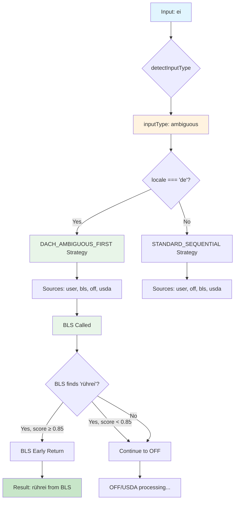

# DACH Routing Correction Implementation Plan

## Root Cause Analysis

### Problem
Deutsche Inputs wie `ei` werden als `inputType="ambiguous"` klassifiziert und dadurch wird BLS übersprungen, obwohl BLS passende Daten hat (z.B. `ei` als Token in `rührei`).

### Current Behavior
- `quark` → `inputType="generic"` → `chosenPriority="DACH_GENERIC_FIRST"` → BLS early return ✅
- `ei` → `inputType="ambiguous"` → `chosenPriority="STANDARD_SEQUENTIAL"` → `BLS SKIPPED locale="de" inputType="ambiguous"` ❌

### Root Cause
1. **[`detectInputType.ts`](src/features/nutrition/application/utils/detectInputType.ts:25)**: `quark` ist in `genericFoods` Liste, `ei` fehlt
2. **[`BlsStaticSource.ts`](src/features/nutrition/infrastructure/catalog/sources/BlsStaticSource.ts:15)**: Harte Regel `query.inputType !== 'generic'` → BLS skip
3. **[`SequentialFoodCatalogResolver.ts`](src/features/nutrition/application/services/SequentialFoodCatalogResolver.ts:725)**: `ambiguous` → `STANDARD_SEQUENTIAL` statt DACH-first

## Solution Strategy

**Option B: BLS Routing-Logik ändern** (gewählt)
- Für `locale=de` soll BLS auch bei `inputType=ambiguous` versucht werden
- DACH-first Strategie für deutsche generische UND unscharfe Alltagsfoods
- Minimal-invasive Änderung ohne große Refactor-Orgie

## Implementation Plan

### 1. Ändere BlsStaticSource Skip-Logik

**Datei**: [`src/features/nutrition/infrastructure/catalog/sources/BlsStaticSource.ts`](src/features/nutrition/infrastructure/catalog/sources/BlsStaticSource.ts:15)

**Aktuell**:
```typescript
if (query.locale !== 'de' || query.inputType !== 'generic') {
  console.log(`[DEBUG] BLS SKIPPED locale="${query.locale}" inputType="${query.inputType}"`);
  return [];
}
```

**Neu**:
```typescript
// DACH Strategy: Allow BLS for German generic AND ambiguous inputs
const allowedInputTypes = ['generic', 'ambiguous'];
if (query.locale !== 'de' || !allowedInputTypes.includes(query.inputType || 'ambiguous')) {
  const reason = query.locale !== 'de' ? 'non_german_locale' : 'branded_input_type';
  console.log(`[${traceId}] PROOF_BLS_SKIPPED reason="${reason}" locale="${query.locale}" inputType="${query.inputType}"`);
  return [];
}

console.log(`[${traceId}] PROOF_BLS_ALLOWED locale="${query.locale}" inputType="${query.inputType}"`);
```

### 2. Erweitere Routing-Strategie für ambiguous

**Datei**: [`src/features/nutrition/application/services/SequentialFoodCatalogResolver.ts`](src/features/nutrition/application/services/SequentialFoodCatalogResolver.ts:725)

**Aktuell**:
```typescript
// For German locale with generic classification: prioritize DACH-compatible sources
if (locale === 'de' && inputType === 'generic') {
  return {
    name: 'DACH_GENERIC_FIRST',
    // ...
  };
}

// Default/ambiguous: standard behavior
return {
  name: 'STANDARD_SEQUENTIAL',
  // ...
};
```

**Neu**:
```typescript
// For German locale with generic OR ambiguous classification: prioritize DACH-compatible sources
if (locale === 'de' && (inputType === 'generic' || inputType === 'ambiguous')) {
  const strategyName = inputType === 'generic' ? 'DACH_GENERIC_FIRST' : 'DACH_AMBIGUOUS_FIRST';
  return {
    name: strategyName,
    offEarlyReturnDisabled: true, // Allow USDA to compete with OFF for better DACH matches
    blsEarlyReturnDisabled: false, // Allow BLS early return for high confidence
    userEarlyReturnDisabled: false, // Allow user early return
    sourcePriority: ['user', 'bls', 'off', 'usda', 'ai'],
  };
}
```

### 3. Anpasse BLS Early Return Logik

**Datei**: [`src/features/nutrition/application/services/SequentialFoodCatalogResolver.ts`](src/features/nutrition/application/services/SequentialFoodCatalogResolver.ts:314)

**Aktuell**:
```typescript
if (
  source.type === 'bls' &&
  query.locale === 'de' &&
  query.inputType === 'generic' &&
  best.score >= 0.75
) {
  // early return
}
```

**Neu**:
```typescript
if (
  source.type === 'bls' &&
  query.locale === 'de' &&
  (query.inputType === 'generic' || query.inputType === 'ambiguous') &&
  best.score >= (query.inputType === 'generic' ? 0.75 : 0.85) // Higher threshold for ambiguous
) {
  // early return with adjusted confidence threshold
}
```

### 4. Verbessere Logging

**Neue Logs hinzufügen**:
- `PROOF_BLS_ALLOWED locale="de" inputType="ambiguous"`
- `PROOF_BLS_SKIPPED reason="branded_input_type" locale="de" inputType="branded"`
- `PROOF_SOURCE_ROUTING_DECISION` bereits vorhanden, wird erweitert

## Target Routing Rules

Nach der Implementierung:

### Für `locale=de`:
- **generic** → `user, bls, off, usda` (BLS early return bei score ≥ 0.75)
- **ambiguous** → `user, bls, off, usda` (BLS early return bei score ≥ 0.85)
- **branded** → `user, off, bls, usda` (OFF-first beibehalten)

### Für andere locales:
- Unverändert: `STANDARD_SEQUENTIAL`

## Files to Modify

1. **[`src/features/nutrition/infrastructure/catalog/sources/BlsStaticSource.ts`](src/features/nutrition/infrastructure/catalog/sources/BlsStaticSource.ts)**
   - Zeile 15: Skip-Logik erweitern
   - Logging verbessern

2. **[`src/features/nutrition/application/services/SequentialFoodCatalogResolver.ts`](src/features/nutrition/application/services/SequentialFoodCatalogResolver.ts)**
   - Zeile 725: Routing-Strategie für ambiguous erweitern
   - Zeile 314: BLS early return für ambiguous anpassen

## Verification Strategy

### Test Cases
```typescript
// Kernfälle die funktionieren müssen:
const testCases = [
  { input: 'ei', locale: 'de', expectedSource: 'bls', expectedMatch: 'rührei' },
  { input: 'quark', locale: 'de', expectedSource: 'bls', expectedMatch: 'magerquark' },
  { input: 'magerquark', locale: 'de', expectedSource: 'bls', expectedMatch: 'magerquark' },
  { input: 'rührei', locale: 'de', expectedSource: 'bls', expectedMatch: 'rührei' },
  { input: 'toast', locale: 'de', expectedSource: 'bls', expectedMatch: 'toast' },
  { input: 'buttertoast', locale: 'de', expectedSource: 'bls', expectedMatch: 'buttertoast' },
];
```

### Expected Log Patterns
```
[traceId] PROOF_SOURCE_ROUTING_DECISION rawInput="ei" classification="ambiguous" locale="de" chosenPriority="DACH_AMBIGUOUS_FIRST"
[traceId] PROOF_BLS_ALLOWED locale="de" inputType="ambiguous"
[traceId] PROOF_BLS_MATCH input="ei" candidates_count=1 best_match="Ruehrei gebraten" score=0.87
```

### Verify Commands
```bash
npm run verify
npm run test -- --testNamePattern="BlsResolverIntegration"
```

## Risk Assessment

### Low Risk
- ✅ Minimal code changes
- ✅ Nur BLS Routing-Logik betroffen
- ✅ Branded behavior unverändert
- ✅ Andere locales unverändert

### Medium Risk
- ⚠️ Ambiguous inputs könnten mehr BLS false positives erzeugen
- ⚠️ Performance: BLS wird öfter aufgerufen

### Mitigation
- Höhere Confidence-Schwelle für ambiguous (0.85 statt 0.75)
- Ausführliches Logging für Monitoring
- Schrittweise Rollout möglich

## Success Criteria

1. ✅ `ei` führt zu BLS-Aufruf und findet `rührei`
2. ✅ `quark` funktioniert weiterhin über BLS
3. ✅ Branded inputs (z.B. `nutella`) bleiben OFF-first
4. ✅ Alle bestehenden Tests bestehen
5. ✅ Neue Logs sind sichtbar und aussagekräftig

## Mermaid Diagram: New Routing Flow



## Implementation Order

1. **Phase 1**: Ändere BlsStaticSource Skip-Logik
2. **Phase 2**: Erweitere Routing-Strategie 
3. **Phase 3**: Anpasse BLS Early Return
4. **Phase 4**: Teste mit Kernfällen
5. **Phase 5**: Verify & Deploy

Jede Phase sollte einzeln getestet werden, bevor zur nächsten übergegangen wird.