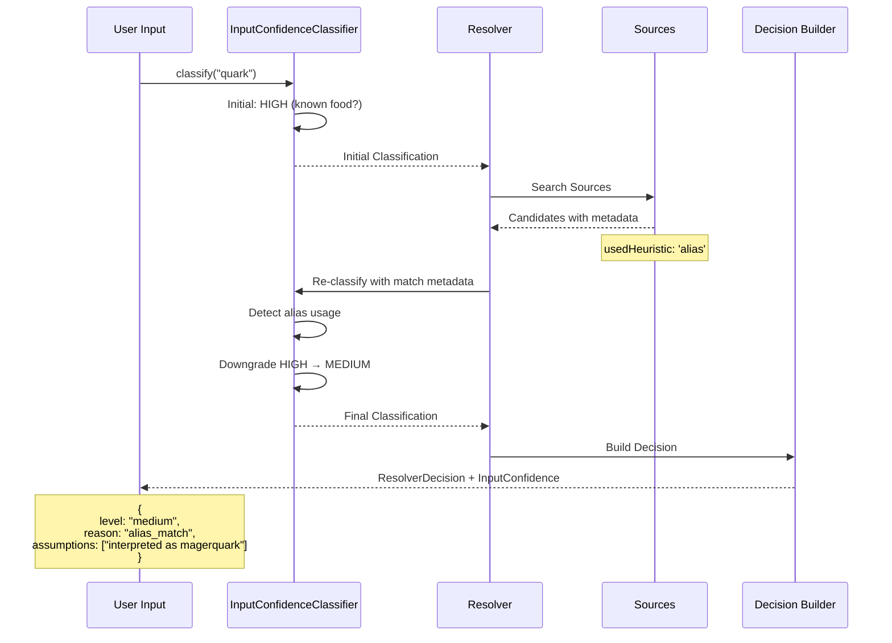

# Input Confidence Layer Implementation Plan

## Überblick

**Ziel:** Einführung einer Input Confidence Layer, die verhindert, dass stille falsche Annahmen aus Alias-basiertem Matching als Fakten behandelt werden.

**Problem:** Das aktuelle System verwendet Aliases (z.B. "quark" → "magerquark"), die semantisch inkorrekt sein können, ohne dies transparent zu machen.

## Architektur-Analyse

### Bestehende Food Resolution Pipeline

```
Input → detectInputType → SequentialFoodCatalogResolver → ResolverDecision
                ↓
        LogFoodFromRawInputUseCase
                ↓
        1. Alias Lookup (FoodAliasRepository)
        2. Multi-source Resolver
        3. Deterministic Catalog Search
        4. AI Mapper (fallback)
```

### Identifizierte Alias-Mechanismen

1. **Statische Aliases** in [`blsGenericFoods.ts`](src/features/nutrition/infrastructure/catalog/sources/blsGenericFoods.ts):
   - `aliases: ['magerquark', 'quark', 'speisequark']`
   - `usedHeuristic: 'alias'` wird gesetzt

2. **User Aliases** in [`SupabaseUserAliasSource.ts`](src/features/nutrition/infrastructure/catalog/sources/SupabaseUserAliasSource.ts):
   - `usedHeuristic: 'alias'` wird gesetzt
   - Hohe Confidence (1.0) für User-definierte Aliases

3. **Cached Aliases** in [`FoodAliasRepository`](src/features/nutrition/application/ports/FoodAliasRepository.ts):
   - Gespeicherte Mappings aus vorherigen Resolutions
   - Confidence 0.8 für cached mappings

4. **Fuzzy Matching** in verschiedenen Sources:
   - `usedHeuristic: 'fuzzy'` wird gesetzt
   - Confidence-Penalty in [`ScoreCalculator.ts`](src/features/nutrition/application/services/ScoreCalculator.ts)

## Input Confidence Layer Design

### 1. Domain Model

#### InputConfidenceLevel
```typescript
export type InputConfidenceLevel = 'high' | 'medium' | 'low';

export interface InputConfidenceClassification {
  level: InputConfidenceLevel;
  reason: string;
  assumptions?: string[];
}
```

#### Erweiterte ResolverDecision
```typescript
export interface ResolverDecision {
  normalizedQuery: string;
  status: ResolverStatus;
  reasonCodes: string[];
  candidates: ResolvedFoodCandidate[];
  best?: ResolvedFoodCandidate;
  secondBest?: ResolvedFoodCandidate;
  createdAt: string;
  
  // NEU: Input Confidence Information
  inputConfidence: InputConfidenceClassification;
}
```

### 2. Input Confidence Classifier

#### InputConfidenceClassifier Service
```typescript
export interface InputConfidenceClassifier {
  classify(
    rawInput: string,
    normalizedInput: string,
    resolverResult?: ResolverDecision
  ): InputConfidenceClassification;
}
```

#### Klassifikationslogik
- **HIGH**: Exakte bekannte Foods (magerquark, toast)
- **MEDIUM**: Alias-Match (quark → magerquark)
- **LOW**: Vage Inputs (pizza, essen)

### 3. Confidence Downgrading Rules

#### Alias Usage Detection
- Wenn `usedHeuristic: 'alias'` → downgrade zu MEDIUM
- Wenn cached alias verwendet → downgrade zu MEDIUM

#### Non-Exact Matches
- Wenn `exact: false` → downgrade zu MEDIUM/LOW
- Wenn `usedHeuristic: 'fuzzy'` → downgrade zu LOW

## Implementierungsplan

### Phase 1: Domain Model Extension

#### 1.1 Erweitere ResolverDecision
**Datei:** [`src/features/nutrition/domain/models/ResolverDecision.ts`](src/features/nutrition/domain/models/ResolverDecision.ts)

```typescript
// Neue Interfaces hinzufügen
export type InputConfidenceLevel = 'high' | 'medium' | 'low';

export interface InputConfidenceClassification {
  level: InputConfidenceLevel;
  reason: string;
  assumptions?: string[];
}

// ResolverDecision erweitern
export interface ResolverDecision {
  // ... bestehende Felder
  inputConfidence: InputConfidenceClassification;
}
```

#### 1.2 Erstelle InputConfidenceClassifier
**Datei:** `src/features/nutrition/domain/confidence/InputConfidenceClassifier.ts`

```typescript
export interface InputConfidenceClassifier {
  classify(
    rawInput: string,
    normalizedInput: string,
    matchMetadata?: {
      usedHeuristic?: string;
      exact?: boolean;
      fromAlias?: boolean;
      fromCache?: boolean;
    }
  ): InputConfidenceClassification;
}
```

### Phase 2: Confidence Classification Implementation

#### 2.1 Default Implementation
**Datei:** `src/features/nutrition/application/services/DefaultInputConfidenceClassifier.ts`

```typescript
export class DefaultInputConfidenceClassifier implements InputConfidenceClassifier {
  classify(
    rawInput: string,
    normalizedInput: string,
    matchMetadata?: MatchMetadata
  ): InputConfidenceClassification {
    // 1. Prüfe auf exakte bekannte Foods
    if (this.isExactKnownFood(normalizedInput)) {
      return {
        level: 'high',
        reason: 'exact_known_food',
      };
    }

    // 2. Prüfe auf Alias-Usage
    if (matchMetadata?.usedHeuristic === 'alias' || matchMetadata?.fromAlias) {
      return {
        level: 'medium',
        reason: 'alias_match',
        assumptions: [`interpreted as ${this.getAliasTarget(normalizedInput)}`],
      };
    }

    // 3. Prüfe auf Fuzzy/Non-exact Matches
    if (matchMetadata?.usedHeuristic === 'fuzzy' || !matchMetadata?.exact) {
      return {
        level: 'low',
        reason: 'fuzzy_or_partial_match',
      };
    }

    // 4. Prüfe auf vage Inputs
    if (this.isVagueInput(rawInput)) {
      return {
        level: 'low',
        reason: 'vague_input',
      };
    }

    // Default: medium confidence
    return {
      level: 'medium',
      reason: 'default_classification',
    };
  }
}
```

### Phase 3: Integration in Resolution Pipeline

#### 3.1 Erweitere SequentialFoodCatalogResolver
**Datei:** [`src/features/nutrition/application/services/SequentialFoodCatalogResolver.ts`](src/features/nutrition/application/services/SequentialFoodCatalogResolver.ts)

```typescript
export class SequentialFoodCatalogResolver implements FoodCatalogResolver {
  constructor(
    private readonly sources: FoodCatalogSource[],
    private readonly _confidenceEngine: ConfidenceEngine,
    private readonly config: FoodCatalogConfig = DEFAULT_CATALOG_CONFIG,
    private readonly inputConfidenceClassifier: InputConfidenceClassifier = new DefaultInputConfidenceClassifier()
  ) {
    // ...
  }

  async resolve(query: FoodSearchQuery, ctx?: { traceId?: string }): Promise<ResolverDecision> {
    // ... bestehende Logik

    // NEU: Klassifiziere Input Confidence
    const inputConfidence = this.classifyInputConfidence(query, decision);
    
    return {
      ...decision,
      inputConfidence,
    };
  }

  private classifyInputConfidence(
    query: FoodSearchQuery,
    decision: ResolverDecision
  ): InputConfidenceClassification {
    const matchMetadata = this.extractMatchMetadata(decision.best);
    
    return this.inputConfidenceClassifier.classify(
      query.raw,
      query.normalized,
      matchMetadata
    );
  }
}
```

#### 3.2 Erweitere ResolverDecisionPolicy
**Datei:** [`src/features/nutrition/application/services/ResolverDecisionPolicy.ts`](src/features/nutrition/application/services/ResolverDecisionPolicy.ts)

```typescript
export function buildResolverDecision(input: {
  normalizedQuery: string;
  candidates: ResolvedFoodCandidate[];
  topN: number;
  inputConfidence?: InputConfidenceClassification;
}): ResolverDecision {
  // ... bestehende Logik

  return {
    // ... bestehende Felder
    inputConfidence: input.inputConfidence || {
      level: 'medium',
      reason: 'not_classified',
    },
  };
}
```

### Phase 4: Alias Detection Enhancement

#### 4.1 Erweitere Alias Repository Interface
**Datei:** [`src/features/nutrition/application/ports/FoodAliasRepository.ts`](src/features/nutrition/application/ports/FoodAliasRepository.ts)

```typescript
export interface AliasLookupResult {
  canonicalId: string;
  isFromCache: boolean;
  originalAlias: string;
}

export interface FoodAliasRepository {
  getCanonicalId(normalized: string): Promise<string | null>;
  getCanonicalIdWithMetadata(normalized: string): Promise<AliasLookupResult | null>;
  saveAlias(normalized: string, canonicalId: string): Promise<void>;
}
```

#### 4.2 Update LogFoodFromRawInputUseCase
**Datei:** [`src/features/nutrition/application/usecases/LogFoodFromRawInputUseCase.ts`](src/features/nutrition/application/usecases/LogFoodFromRawInputUseCase.ts)

```typescript
// Step 2: Alias lookup mit Metadata
if (this.aliasRepository) {
  const aliasResult = await this.aliasRepository.getCanonicalIdWithMetadata(aliasKey);
  if (aliasResult) {
    // Markiere als Alias-basiert für Confidence Classification
    const food = await this.foodCatalog.getById(aliasResult.canonicalId);
    if (food) {
      return {
        canonicalFood: food,
        sourceType: 'generic',
        confidence: 0.8,
        explanation: 'Cached alias mapping',
        aliasMetadata: {
          fromAlias: true,
          fromCache: aliasResult.isFromCache,
          originalAlias: aliasResult.originalAlias,
        },
      };
    }
  }
}
```

## Architektur-Diagramm

```mermaid
graph TD
    A[Raw Input: "quark"] --> B[InputConfidenceClassifier]
    B --> C{Input Classification}
    C -->|HIGH| D[Exact Known Food]
    C -->|MEDIUM| E[Alias/Cached Match]
    C -->|LOW| F[Vague/Fuzzy Input]
    
    A --> G[SequentialFoodCatalogResolver]
    G --> H[Source Resolution]
    H --> I[Match Metadata Analysis]
    I --> J{Alias Used?}
    J -->|Yes| K[Downgrade to MEDIUM]
    J -->|No| L{Fuzzy Match?}
    L -->|Yes| M[Downgrade to LOW]
    L -->|No| N[Keep Original Level]
    
    K --> O[ResolverDecision + InputConfidence]
    M --> O
    N --> O
    
    O --> P[LogFoodFromRawInputUseCase]
    P --> Q[Result with Confidence Info]
```

## Confidence Flow Diagramm



## Test Strategy

### Unit Tests

#### InputConfidenceClassifier Tests
```typescript
describe('DefaultInputConfidenceClassifier', () => {
  it('should classify exact known foods as HIGH', () => {
    const result = classifier.classify('magerquark', 'magerquark');
    expect(result.level).toBe('high');
    expect(result.reason).toBe('exact_known_food');
  });

  it('should classify alias matches as MEDIUM', () => {
    const result = classifier.classify('quark', 'quark', {
      usedHeuristic: 'alias',
      fromAlias: true,
    });
    expect(result.level).toBe('medium');
    expect(result.reason).toBe('alias_match');
    expect(result.assumptions).toContain('interpreted as magerquark');
  });

  it('should classify fuzzy matches as LOW', () => {
    const result = classifier.classify('pizza', 'pizza', {
      usedHeuristic: 'fuzzy',
      exact: false,
    });
    expect(result.level).toBe('low');
    expect(result.reason).toBe('fuzzy_or_partial_match');
  });
});
```

#### Integration Tests
```typescript
describe('Input Confidence Integration', () => {
  it('should downgrade confidence when alias is used', async () => {
    const resolver = new SequentialFoodCatalogResolver(sources, engine, config, classifier);
    const result = await resolver.resolve({ raw: 'quark', normalized: 'quark', locale: 'de' });
    
    expect(result.inputConfidence.level).toBe('medium');
    expect(result.inputConfidence.reason).toBe('alias_match');
  });
});
```

## Migration Strategy

### Backward Compatibility
- Bestehende ResolverDecision Interfaces bleiben kompatibel
- InputConfidence wird als optionales Feld hinzugefügt
- Fallback auf default confidence wenn nicht klassifiziert

### Rollout Plan
1. **Phase 1:** Domain Model Extension (keine Breaking Changes)
2. **Phase 2:** Classifier Implementation (interne Services)
3. **Phase 3:** Integration in Resolution Pipeline
4. **Phase 4:** Enhanced Alias Detection
5. **Phase 5:** UI Integration (separate Task)

## Erwartete Ergebnisse

### Vor der Implementierung
```typescript
// Input: "quark"
{
  canonicalFood: { name: "Magerquark", ... },
  confidence: 0.85,
  explanation: "Resolver match: Magerquark"
}
// → User weiß nicht, dass "quark" als "magerquark" interpretiert wurde
```

### Nach der Implementierung
```typescript
// Input: "quark"
{
  canonicalFood: { name: "Magerquark", ... },
  confidence: 0.85,
  explanation: "Resolver match: Magerquark",
  inputConfidence: {
    level: "medium",
    reason: "alias_match",
    assumptions: ["interpreted as magerquark"]
  }
}
// → System macht Annahmen transparent
```

## Nächste Schritte

1. **Review dieses Plans** mit dem Team
2. **Implementierung Phase 1:** Domain Model Extension
3. **Implementierung Phase 2:** Classifier Service
4. **Integration Tests** für die gesamte Pipeline
5. **UI Integration** (separater Task) zur Anzeige der Confidence Information

## Offene Fragen

1. **Granularität:** Sollen wir zusätzliche Confidence Levels einführen (very_high, very_low)?
2. **Lokalisierung:** Sollen Confidence Reasons lokalisiert werden?
3. **Performance:** Wie wirkt sich die zusätzliche Classification auf die Performance aus?
4. **Caching:** Sollen Confidence Classifications gecacht werden?